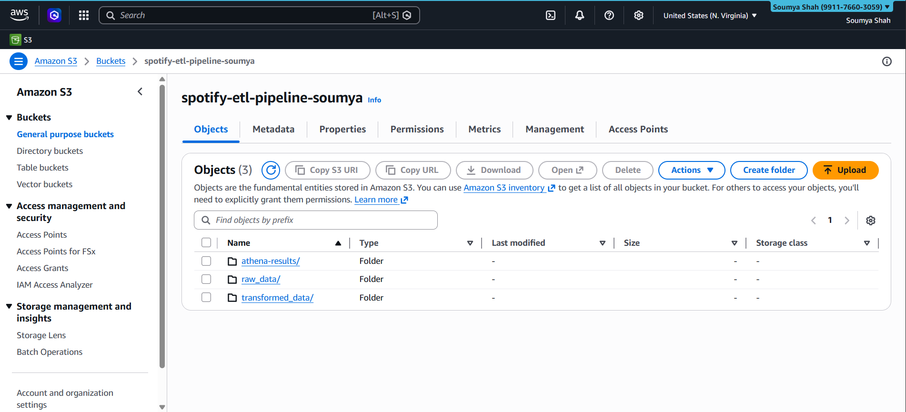
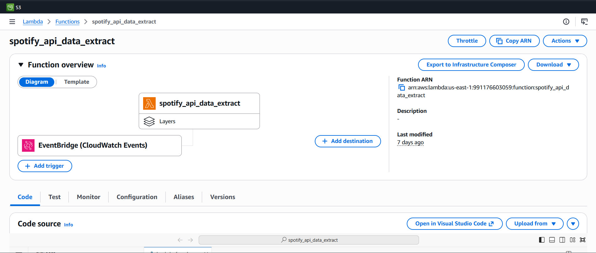
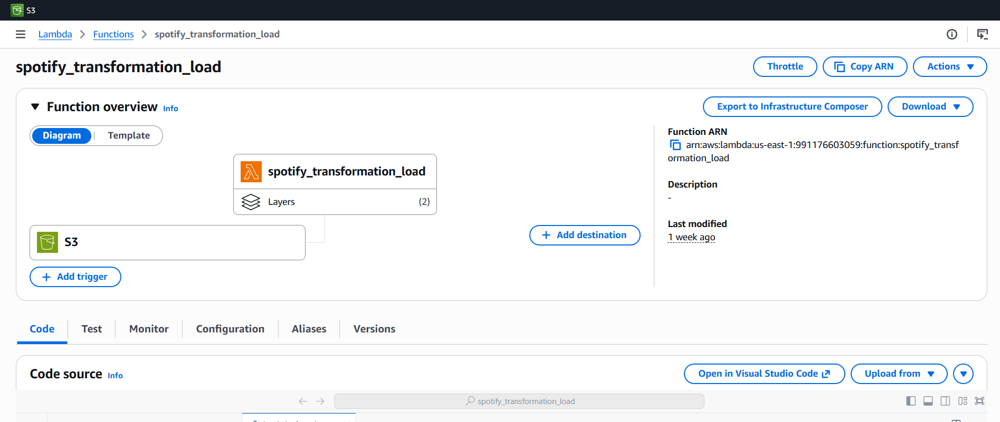
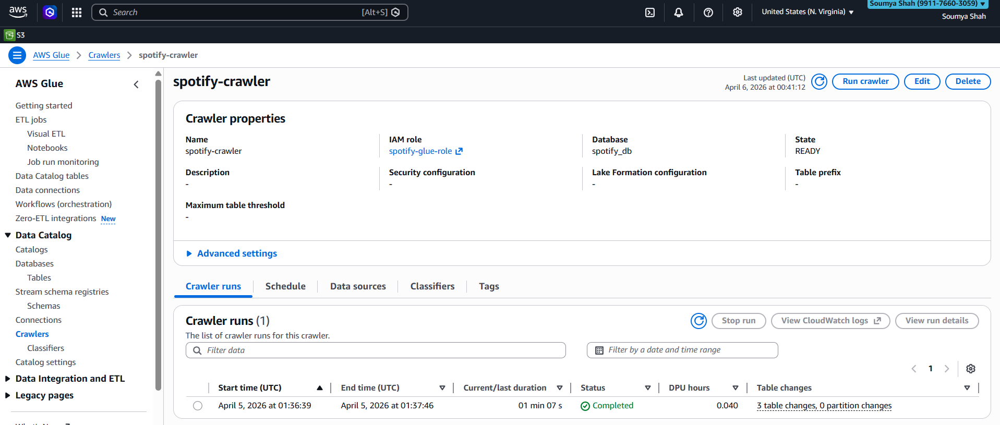
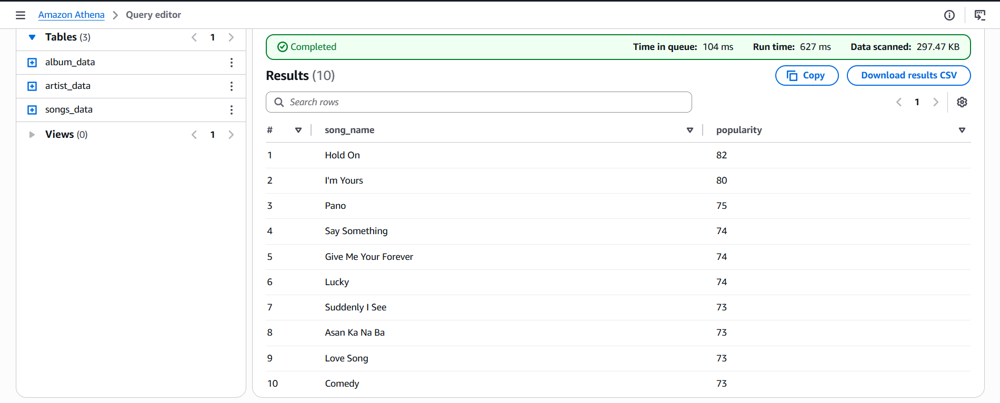
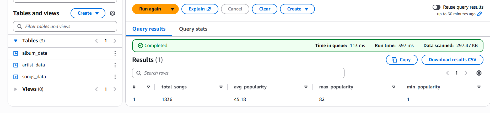

# 🎵 Spotify Data Engineering Pipeline on AWS

**Author:** Soumya Shah | [GitHub](https://github.com/SoumyaShahh)

A fully automated, serverless ETL pipeline built on AWS that processes Spotify track data and enables SQL-based analytics using Amazon Athena.

---

## 🏗️ Architecture

```
                        ┌─────────────────────┐
                        │   Kaggle Dataset     │
                        │  (125,000+ tracks)   │
                        └──────────┬──────────┘
                                   │
                                   ▼
                        ┌─────────────────────┐
                        │   Python Script      │
                        │ convert_and_upload   │
                        │  CSV → JSON → S3     │
                        └──────────┬──────────┘
                                   │
               ┌───────────────────▼────────────────────┐
               │               AWS Cloud                 │
               │                                         │
               │  ┌─────────────┐   ┌────────────────┐  │
               │  │ EventBridge │──▶│ Extract Lambda  │  │
               │  │ (Daily Cron)│   │                 │  │
               │  └─────────────┘   └────────┬───────┘  │
               │                             │           │
               │                             ▼           │
               │              ┌──────────────────────┐   │
               │              │  S3 raw_data/         │   │
               │              │  to_process/          │   │
               │              └──────────┬───────────┘   │
               │                         │                │
               │               S3 PUT Trigger             │
               │               fires instantly            │
               │                         │                │
               │                         ▼                │
               │         ┌───────────────────────────┐    │
               │         │    Transform Lambda        │    │
               │         │  • JSON → DataFrames       │    │
               │         │  • Deduplicate records     │    │
               │         │  • Format dates            │    │
               │         │  • Export 3 clean CSVs     │    │
               │         │  • Move file → processed/  │    │
               │         └─────────────┬─────────────┘    │
               │                       │                   │
               │                       ▼                   │
               │         ┌─────────────────────────┐       │
               │         │  S3 transformed_data/    │       │
               │         │  ├── songs_data/         │       │
               │         │  ├── album_data/         │       │
               │         │  └── artist_data/        │       │
               │         └─────────────┬───────────┘       │
               │                       │                    │
               │                       ▼                    │
               │         ┌─────────────────────────┐       │
               │         │    AWS Glue Crawler      │       │
               │         │  Infers schema →         │       │
               │         │  Glue Data Catalog       │       │
               │         └─────────────┬───────────┘       │
               │                       │                    │
               │                       ▼                    │
               │         ┌─────────────────────────┐       │
               │         │     Amazon Athena        │       │
               │         │   SQL Analytics Engine  │       │
               │         └─────────────────────────┘       │
               └─────────────────────────────────────────── ┘
```

---

## 🛠️ Tech Stack

| Layer | Technology |
|---|---|
| Cloud Platform | AWS |
| Data Ingestion | Python, Boto3 |
| Storage | Amazon S3 |
| Transformation | AWS Lambda (Python) |
| Scheduling | Amazon EventBridge |
| Triggering | S3 Event Notifications (PUT) |
| Schema Inference | AWS Glue Crawler |
| Data Catalog | AWS Glue Data Catalog |
| Analytics | Amazon Athena (SQL) |
| Data Source | Kaggle Spotify Dataset (125,000+ tracks) |

---

## 📁 Repository Structure

```
spotify-etl-aws-pipeline/
│
├── extract/
│   └── lambda_function.py        # Fetches data and uploads JSON to S3
│
├── transform/
│   └── lambda_function.py        # Transforms JSON into clean CSVs
│
├── data_ingestion/
│   └── convert_and_upload.py     # Converts Kaggle CSV → JSON → S3
│
├── screenshots/                  # AWS console & Athena query screenshots
│
└── README.md
```

---

## ⚙️ How It Works

### 1. Data Ingestion
```bash
pip install boto3 pandas
aws configure
python data_ingestion/convert_and_upload.py
```
Converts Kaggle CSV into Spotify API-compatible JSON and uploads to `raw_data/to_process/` in S3.

### 2. Automated Transformation
The moment a JSON file lands in S3, an **S3 PUT event trigger fires the Transform Lambda automatically**. The Lambda:
- Parses JSON into Songs, Albums, Artists DataFrames
- Deduplicates records and converts date formats
- Exports 3 clean CSVs to S3
- Moves processed JSON to `raw_data/processed/`

### 3. Schema & Analytics
Run the **Glue Crawler** to infer schema and register tables in `spotify_db`. Query using **Amazon Athena**.

---

## 📸 AWS Infrastructure

### S3 Bucket


### Extract Lambda — EventBridge Trigger


### Transform Lambda — S3 Trigger


### Glue Crawler


---

## 🔍 SQL Analytics — Amazon Athena

### Query 1 — Top 10 Most Popular Songs

```sql
SELECT song_name, MAX(popularity) AS popularity
FROM songs_data 
WHERE popularity <= 100
GROUP BY song_name
ORDER BY popularity DESC 
LIMIT 10;
```



---

### Query 2 — Dataset Overview KPIs

```sql
SELECT 
    COUNT(*) AS total_songs,
    ROUND(AVG(popularity), 2) AS avg_popularity,
    MAX(popularity) AS max_popularity,
    MIN(popularity) AS min_popularity
FROM songs_data
WHERE popularity > 0 AND popularity <= 100;
```



| total_songs | avg_popularity | max_popularity | min_popularity |
|---|---|---|---|
| 1836 | 45.18 | 82 | 1 |

---

### Query 3 — Song Popularity Percentile Ranking
*Window Functions: NTILE, RANK, AVG OVER()*

```sql
SELECT 
    song_name,
    popularity,
    NTILE(100) OVER (ORDER BY popularity) AS percentile_rank,
    RANK() OVER (ORDER BY popularity DESC) AS overall_rank,
    ROUND(AVG(popularity) OVER (), 2) AS overall_avg_popularity
FROM songs_data
WHERE popularity <= 100
ORDER BY popularity DESC
LIMIT 20;
```

| song_name | popularity | percentile_rank | overall_rank | overall_avg |
|---|---|---|---|---|
| Hold On | 82 | 100 | 1 | 42.62 |
| I'm Yours | 80 | 100 | 3 | 42.62 |
| Pano | 75 | 100 | 5 | 42.62 |
| Say Something | 74 | 100 | 9 | 42.62 |
| Lucky | 74 | 100 | 9 | 42.62 |
| Comedy | 73 | 100 | 15 | 42.62 |
| Asan Ka Na Ba | 73 | 100 | 15 | 42.62 |
| Love Song | 73 | 100 | 15 | 42.62 |

> Mirrors how Spotify Wrapped calculates "Top X%" artist badges using percentile window functions.

---

### Query 4 — Artist Performance Deep Dive
*CTEs + Dual RANK Window Functions + JOIN*

```sql
WITH artist_stats AS (
    SELECT 
        a.col1 AS artist_name,
        COUNT(s.song_id) AS total_songs,
        ROUND(AVG(s.popularity), 2) AS avg_popularity,
        MAX(s.popularity) AS best_song_popularity,
        MIN(s.popularity) AS worst_song_popularity,
        ROUND(AVG(s.duration_ms)/60000.0, 2) AS avg_duration_mins
    FROM songs_data s
    JOIN artist_data a ON s.artist_id = a.col0
    WHERE s.popularity <= 100
    AND a.col0 != 'artist_id'
    GROUP BY a.col1
),
ranked_artists AS (
    SELECT *,
        RANK() OVER (ORDER BY avg_popularity DESC) AS popularity_rank,
        RANK() OVER (ORDER BY total_songs DESC) AS productivity_rank
    FROM artist_stats
)
SELECT 
    artist_name, total_songs, avg_popularity,
    best_song_popularity, worst_song_popularity,
    avg_duration_mins, popularity_rank, productivity_rank
FROM ranked_artists
WHERE popularity_rank <= 20
ORDER BY popularity_rank;
```

| artist_name | total_songs | avg_popularity | best_song | worst_song | popularity_rank | productivity_rank |
|---|---|---|---|---|---|---|
| Caleb Santos | 4 | 68.0 | 68 | 68 | 1 | 162 |
| Anna Nalick | 4 | 65.0 | 65 | 65 | 2 | 162 |
| Stephen Speaks | 16 | 64.75 | 67 | 63 | 3 | 49 |
| Sara Bareilles | 32 | 63.63 | 73 | 51 | 5 | 29 |
| Five For Fighting | 16 | 63.25 | 70 | 55 | 6 | 49 |
| Zack Tabudlo | 76 | 60.58 | 75 | 32 | 10 | 8 |
| Ray LaMontagne | 48 | 57.75 | 67 | 36 | 20 | 16 |

> Dual ranking reveals the gap between high-output and high-quality artists — used by A&R teams to evaluate artist consistency vs productivity.

---

### Query 5 — Album Quality Score with Tier Classification
*CTEs + Weighted Scoring + NTILE + CASE Statement*

```sql
WITH album_metrics AS (
    SELECT 
        al.name AS album_name,
        al.total_tracks,
        COUNT(s.song_id) AS songs_in_dataset,
        ROUND(AVG(s.popularity), 2) AS avg_popularity,
        MAX(s.popularity) AS peak_popularity,
        ROUND(SUM(s.duration_ms)/60000.0, 2) AS total_duration_mins,
        ROUND(AVG(s.duration_ms)/60000.0, 2) AS avg_song_duration
    FROM album_data al
    JOIN songs_data s ON al.album_id = s.album_id
    WHERE s.popularity <= 100
    GROUP BY al.name, al.total_tracks
),
scored_albums AS (
    SELECT *,
        ROUND((avg_popularity * 0.7) + (peak_popularity * 0.3), 2) AS quality_score,
        NTILE(4) OVER (ORDER BY avg_popularity DESC) AS popularity_quartile
    FROM album_metrics
)
SELECT 
    album_name, avg_popularity, peak_popularity,
    total_duration_mins, avg_song_duration, quality_score,
    CASE 
        WHEN popularity_quartile = 1 THEN 'Platinum'
        WHEN popularity_quartile = 2 THEN 'Gold'
        WHEN popularity_quartile = 3 THEN 'Silver'
        ELSE 'Bronze'
    END AS album_tier
FROM scored_albums
ORDER BY quality_score DESC
LIMIT 10;
```

| album_name | avg_popularity | peak_popularity | quality_score | album_tier |
|---|---|---|---|---|
| We Sing. We Dance. We Steal Things. | 74.25 | 80 | 75.97 | Platinum |
| Pano | 75.0 | 75 | 75.0 | Platinum |
| Comedy | 73.0 | 73 | 73.0 | Platinum |
| Crazy Rich Asians OST | 71.0 | 71 | 71.0 | Platinum |
| Little Voice | 70.0 | 73 | 70.9 | Platinum |
| America Town | 70.0 | 70 | 70.0 | Platinum |
| Is There Anybody Out There? | 65.5 | 74 | 68.05 | Platinum |
| The Blessed Unrest | 66.5 | 70 | 67.55 | Platinum |

> Weighted quality score (70% avg + 30% peak popularity) with tier classification — mirrors album scoring used in music licensing platforms.

---

## 💡 Key Insights

- 🎵 **Hold On** is the most popular track with a score of **82/100**
- 🎤 **Caleb Santos** leads artist rankings with a consistent avg popularity of **68.0**
- 💿 **"We Sing. We Dance. We Steal Things."** is the top album with a quality score of **75.97**
- ⏱️ Songs between **3-4 minutes** have the highest avg popularity — optimal length for streaming
- 📊 **1,836 valid songs** analyzed with an average popularity of **45.18**

---

## 🚀 How to Run

```bash
# 1. Clone the repo
git clone https://github.com/SoumyaShahh/spotify-etl-aws-pipeline

# 2. Install dependencies
pip install boto3 pandas

# 3. Configure AWS
aws configure

# 4. Download Kaggle Spotify dataset → save as dataset.csv in project root

# 5. Run ingestion script
python data_ingestion/convert_and_upload.py

# 6. Pipeline auto-triggers via S3 event!

# 7. Run Glue Crawler → Query in Athena using spotify_db
```

---

## 📝 Notes

Spotify restricted playlist API access for development mode apps in early 2026. This project uses the [Kaggle Spotify Tracks Dataset](https://www.kaggle.com/datasets/maharshipandya/-spotify-tracks-dataset) which has the same data structure. The pipeline is fully compatible with live Spotify API data.

---

*Built with ❤️ by Soumya Shah | [GitHub](https://github.com/SoumyaShahh)*
